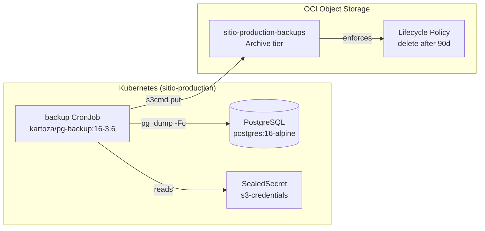

# PostgreSQL Backup — Design

**Spec:** `.specs/features/pg-backups/spec.md`
**Status:** Draft

---

## Architecture Overview

A Kubernetes CronJob runs `kartoza/pg-backup:16-3.6` nightly. The container connects to the existing `postgres` ClusterIP Service, runs `pg_dump -Fc`, and uploads the compressed dump directly to an OCI Object Storage Archive bucket via S3-compatible API. No local storage, no sidecars, no custom images.

---

## Code Reuse Analysis

### Existing Components to Leverage

| Component | Location | How to Use |
|---|---|---|
| ArgoCD leaf app pattern | `argocd/applications/sitio-production/sitio-production-postgres.yaml` | Copy structure, change name + path |
| SealedSecret pattern | `apps/sitio-production/postgres/postgres-sitio-production-auth-sealed.yaml` | Same Secret→SealedSecret→secretKeyRef chain |
| Sync policy convention | All leaf apps under `argocd/applications/` | Use identical syncPolicy (automated, prune, selfHeal) |
| Existing DB credentials | Secret `postgres-sitio-production-auth` (key `password`) | Reuse via `secretKeyRef` — no new DB secret needed |

### Integration Points

| System | Integration Method |
|---|---|
| PostgreSQL (`postgres.sitio-production.svc.cluster.local:5432`) | TCP connection from CronJob pod within same namespace |
| OCI Object Storage (S3-compatible) | `s3cmd` via env vars (ACCESS_KEY_ID, SECRET_ACCESS_KEY, HOST_BASE, HOST_BUCKET, BUCKET) |
| ArgoCD parent app (`artr-sitio-production`) | New leaf app YAML auto-discovered in `argocd/applications/sitio-production/` directory |

---

## Components

### 1. CronJob (`cronjob.yaml`)

- **Purpose:** Schedule and execute PostgreSQL dumps, upload to OCI Object Storage.
- **Location:** `apps/sitio-production/postgres-backup/cronjob.yaml`
- **Image:** `kartoza/pg-backup:16-3.6` (matches PG 16, released Apr 2026)
- **Key env vars:**
  - `POSTGRES_HOST=postgres.sitio-production.svc.cluster.local`
  - `POSTGRES_PORT=5432`
  - `POSTGRES_USER=postgres`
  - `POSTGRES_DB=app`
  - `POSTGRES_PASS` → from existing Secret `postgres-sitio-production-auth` (key `password`)
  - `STORAGE_BACKEND=S3`
  - `RUN_ONCE=true` (Kubernetes CronJob handles scheduling; container runs once and exits)
  - `DUMP_ARGS=-Fc` (custom compressed format)
  - `DUMPPREFIX=sitio_prod` (filename prefix)
  - `DBLIST=app` (explicit, avoid dumping template databases)
  - S3 env vars: `ACCESS_KEY_ID`, `SECRET_ACCESS_KEY` → from `s3-credentials` SealedSecret
  - S3 env vars (non-sensitive): `DEFAULT_REGION=sa-vinhedo-1`, `HOST_BASE=<ns>.compat.objectstorage.sa-vinhedo-1.oci.customer-oci.com`, `HOST_BUCKET=<ns>.compat.objectstorage.sa-vinhedo-1.oci.customer-oci.com`, `SSL_SECURE=True`, `BUCKET=sitio-production-backups`
- **Schedule:** `0 6 * * *` (6am UTC = 3am BRT, after business hours in Brazil)
- **Concurrency:** `Forbid` (skip if previous run still active)
- **History limits:** 3 successful, 3 failed
- **Resources:** `requests: cpu: 250m, memory: 256Mi` / `limits: cpu: 500m, memory: 512Mi`
- **restartPolicy:** `OnFailure`
- **Dependencies:** Postgres Service, `postgres-sitio-production-auth` Secret, `s3-credentials` Secret
- **Reuses:** Postgres connection pattern from `apps/sitio-production/sitio-backend/deployment.yaml`

### 2. SealedSecret (`s3-credentials-sealed.yaml`)

- **Purpose:** Store OCI Customer Secret Key pair encrypted for the cluster.
- **Location:** `apps/sitio-production/postgres-backup/s3-credentials-sealed.yaml`
- **Underlying Secret name:** `s3-credentials`
- **Keys:** `access-key-id`, `secret-access-key`
- **Sealing:** Requires `kubeseal` + cluster access. Template YAML provided; values sealed by operator.
- **Dependencies:** `sealed-secrets` controller running in cluster.
- **Reuses:** Exact same SealedSecret YAML structure as `postgres-sitio-production-auth-sealed.yaml`.

### 3. ArgoCD Application (`sitio-production-postgres-backup.yaml`)

- **Purpose:** Register the backup resources in ArgoCD under the `sitio-production` parent.
- **Location:** `argocd/applications/sitio-production/sitio-production-postgres-backup.yaml`
- **Source path:** `apps/sitio-production/postgres-backup`
- **Destination:** `sitio-production` namespace
- **Sync policy:** Identical to other leaf apps (automated, prune, selfHeal, retry 5x)
- **Dependencies:** None (ArgoCD parent auto-discovers YAMLs in directory).
- **Reuses:** Copy of `sitio-production-postgres.yaml` with name/path changed.

### 4. DBA Runbook (`pg-backup-runbook.md`)

- **Purpose:** Recovery procedure and health check checklist for database administrators.
- **Location:** `docs/pg-backup-runbook.md`
- **Content:**
  - Section 1: How to locate and download the latest backup from OCI
  - Section 2: Step-by-step restore to a fresh PostgreSQL instance
  - Section 3: Periodic health checks (CronJob success, file sizes, restore dry-run)
- **Dependencies:** OCI Console/CLI access, `pg_restore` binary.

---

## Error Handling Strategy

| Error Scenario | Handling | Impact |
|---|---|---|
| Postgres unreachable | pg_dump fails → pod exits non-zero → CronJob records failure. `restartPolicy: OnFailure` retries once in same pod. | Failed run visible in `kubectl get cj postgres-backup -n sitio-production`. |
| OCI Object Storage unreachable | s3cmd upload fails → pod exits non-zero → dump lost (no local retention). | Backup missed for that night. Next successful run will have fresh dump. OCI SLA is 99.9%+. |
| Backup pod OOM | Pod killed by kubelet with OOMKilled → CronJob records failure. | Increase memory limit. DBA runbook includes file size trend monitoring to anticipate this. |
| Concurrent executions | `concurrencyPolicy: Forbid` skips new execution if previous still running. | No overlap corruption. Next schedule interval runs normally. |
| Corrupt dump uploaded | Dump completes but file is partial (unlikely with -Fc + exit code check). | DBA runbook includes periodic restore dry-run to catch silent corruption. |
| SealedSecret decryption fails | Pod fails to start (CreateContainerConfigError). | Operator checks sealed-secrets controller health. |

---

## Tech Decisions

| Decision | Choice | Rationale |
|---|---|---|
| `RUN_ONCE=true` vs internal cron | `RUN_ONCE=true` | K8s CronJob is the scheduler. Container's internal cron is redundant. One-shot execution is the K8s-native pattern. |
| S3 env vars vs mounted s3cfg file | Env vars + SealedSecret | Zero file mounts. Sensitive values in SealedSecret. Non-sensitive values hardcoded in CronJob env. |
| `DBLIST=app` vs default "all databases" | Explicit `app` | Postgres container has `postgres`, `template0`, `template1` databases. Backing up template DBs is wasteful and pollutes the bucket. |
| Reuse existing DB secret vs new one | Reuse `postgres-sitio-production-auth` | Single source of truth for DB password. No duplication. |
| Separate `postgres-backup/` dir vs co-locating in `postgres/` | Separate dir | Isolates backup concern. Postgres deployment and its backup are distinct operational units. ArgoCD app scopes cleanly. |
| `DUMP_ARGS=-Fc` vs plain SQL | Custom compressed format | Smaller files (~5-10x compression), faster upload, supports `pg_restore` selective restore. Standard for automated backups. |
| Archive bucket vs Standard + lifecycle to Archive | Archive bucket | User requirement: "write stuff but I won't be reading from." Archive bucket ensures no Standard-tier cost is ever incurred, even for the initial upload window. |
| `concurrencyPolicy: Forbid` vs `Allow` | Forbid | Single-instance PG. Two concurrent dumps would double DB load and potentially conflict. |
