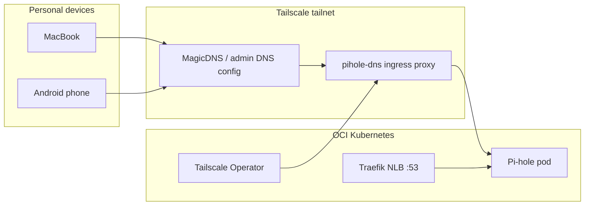

# Tailscale + Pi-hole Design

**Spec**: `.specs/features/tailscale-pihole/spec.md`  
**Status**: Approved

---

## Architecture Overview

Pi-hole stays in the `platform` namespace with Traefik handling public DNS (unchanged). The Tailscale Kubernetes Operator runs in `tailscale` and exposes the existing `pihole-dns` ClusterIP Service on the tailnet via L3 ingress (`tailscale.com/expose: "true"`). Personal devices join the tailnet and use Tailscale-managed global DNS pointing at `pihole-dns.<tailnet>.ts.net`.



---

## Components

| Component | Location | Purpose |
|---|---|---|
| Tailscale Operator (Helm) | `tailscale` namespace | Reconciles exposed Services; creates tailnet proxies |
| `operator-oauth` Secret | `tailscale` namespace | OAuth client credentials (SealedSecret, not in Git plaintext) |
| Pi-hole Helm values patch | `charts/pihole-values.yaml` | `tailscale.com/expose`, `FTLCONF_dns_listeningMode=all` |
| ArgoCD apps | `argocd/applications/platform/` | `platform-tailscale-operator` (sync-wave -1), existing `platform-pihole` |
| Setup runbook | `docs/tailscale-pihole-setup.md` | ACL, OAuth, DNS admin, Mac/Android steps |

---

## Pi-hole Service Exposure

Use **annotation-based L3 expose** on the existing ClusterIP `pihole-dns` Service (via Helm `serviceDns.annotations`). This avoids changing `serviceDns.type` to `LoadBalancer`, so Traefik IngressRouteUDP/TCP to port 53 remain intact.

```yaml
serviceDns:
  mixedService: true
  type: ClusterIP
  annotations:
    tailscale.com/expose: "true"
    tailscale.com/hostname: "pihole-dns"
extraEnvVars:
  FTLCONF_dns_listeningMode: "all"
```

---

## Tailscale Admin DNS (manual, post-deploy)

After `pihole-dns` appears in Machines:

1. **DNS → Nameservers → Add custom** → `pihole-dns.<tailnet>.ts.net` (or its `100.x` IP)
2. **Add fallback** → `1.1.1.1` (if Pi-hole/cluster unavailable)
3. Enable **Override local DNS**
4. Keep **MagicDNS** enabled

---

## ACL Tags (manual in Tailscale admin)

Minimum policy fragment:

```json
"tagOwners": {
  "tag:k8s-operator": ["autogroup:admin"],
  "tag:k8s": ["tag:k8s-operator"]
}
```

OAuth client needs **Devices: Write** and **Auth Keys: Write**, scoped to tag `tag:k8s-operator`.

---

## Reuse

- ArgoCD multi-source Helm pattern from `platform-pihole.yaml`
- SealedSecret bootstrap pattern from `docs/pocketid-tinyauth-setup.md`
- Existing Pi-hole chart 2.35.0 and `apps/platform/pihole/` IngressRoutes

---

## Risks

| Risk | Mitigation |
|---|---|
| Operator syncs before OAuth Secret | Document bootstrap order; operator app sync-wave -1, secret created first |
| Android DNS conflicts with Private DNS | Runbook step to disable Android Private DNS |
| Pi-hole rejects non-local queries | `FTLCONF_dns_listeningMode=all` |
