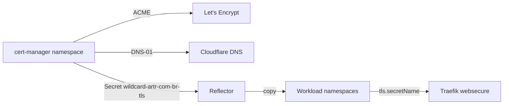

# Certificate Runbook

Operational guide for the wildcard TLS certificate (`*.artr.com.br`) managed by cert-manager, Let's Encrypt DNS-01 (Cloudflare), and Emberstack Reflector.

**Related:** [Postmortem 2026-06](postmortems/2026-06-certificate-expiry.md) · [Rotate Cloudflare token](change-cloud-flare-token.md)

---

## Architecture



- **Single source of truth:** `Certificate/wildcard-artr-com-br` in `cert-manager` namespace
- **Secret name:** `wildcard-artr-com-br-tls` (all IngressRoutes reference this name locally)
- **Propagation:** Reflector auto-copies to `argocd`, `staging`, `production`, `platform`, `monitoring`, `sitio-staging`, `sitio-production`
- **Important:** Workload namespaces must hold **Reflector copies** (`reflector.v1.k8s.emberstack.com/reflects` annotation). Orphan secrets with only `cert-manager.io/*` annotations will **not** update on renewal.

---

## Monitoring

Alerts (via kube-prometheus-stack + blackbox exporter):

| Alert | Meaning |
|---|---|
| `CertManagerCertificateNotReady` | cert-manager cannot issue/renew — check Cloudflare token and ACME challenges |
| `CertManagerCertificateExpirySoon` | Certificate CR expires within 21 days |
| `TlsProbeFailed` | External HTTPS probe failing |
| `TlsCertificateExpirySoon` | Cert **served to browsers** expires within 7 days (catches Reflector drift) |

View alerts: Alertmanager UI (via Grafana or port-forward to `alertmanager-operated` in `monitoring`).

---

## Quick diagnosis

```bash
# 1. Certificate CR status
kubectl get certificate -A
kubectl describe certificate -n cert-manager wildcard-artr-com-br

# 2. ACME pipeline
kubectl get certificaterequest,order,challenge -n cert-manager
kubectl describe challenge -n cert-manager

# 3. Cloudflare token validity
TOKEN=$(kubectl get secret -n cert-manager cloudflare-api-token-secret \
  -o jsonpath='{.data.api-token}' | base64 -d)
curl -s -H "Authorization: Bearer $TOKEN" \
  https://api.cloudflare.com/client/v4/user/tokens/verify | jq .

# 4. What browsers actually see
openssl s_client -connect argo.artr.com.br:443 -servername argo.artr.com.br </dev/null 2>/dev/null \
  | openssl x509 -noout -dates -subject

# 5. Reflector propagation
./scripts/audit-tls-secrets.sh
```

---

## Rotate Cloudflare API token

See [change-cloud-flare-token.md](change-cloud-flare-token.md) for the kubeseal command.

**Required token permissions:** `Zone:DNS:Edit` on `artr.com.br`.

### Post-rotation checklist

- [ ] Token verifies: `curl …/tokens/verify` returns `"status": "active"`
- [ ] SealedSecret committed and ArgoCD `cert-manager-resources` synced
- [ ] `Certificate/wildcard-artr-com-br` becomes `Ready=True` within 10 minutes
- [ ] If stuck >10m: delete ACME resources (see below)
- [ ] `./scripts/audit-tls-secrets.sh` passes
- [ ] `openssl s_client` on `argo.artr.com.br` shows new `notAfter` date

---

## Unstick ACME renewal

When challenges are stuck (invalid token, rate limits, stale orders):

```bash
# Delete pending ACME resources — cert-manager recreates them
kubectl delete challenge,order,certificaterequest -n cert-manager \
  -l cert-manager.io/certificate-name=wildcard-artr-com-br

# Watch progress
kubectl get certificate,challenge,order -n cert-manager -w
```

**Cloudflare rate limit (`10502`):** Stop invalid auth attempts, wait 15–60 minutes after fixing the token before retrying.

---

## Fix stale TLS secrets (Reflector drift)

Symptom: cert-manager shows `Ready=True` but `openssl s_client` still serves an expired cert on some hosts.

**Cause:** Namespace has an old secret not managed by Reflector (common in `argocd` if cert-manager issued directly before Reflector was configured).

```bash
# Audit all namespaces
./scripts/audit-tls-secrets.sh

# Delete orphan/stale copies — Reflector recreates from source
kubectl delete secret -n <namespace> wildcard-artr-com-br-tls

# If secrets are not recreated within 30s, restart Reflector
kubectl rollout restart deployment/reflector -n reflector
```

**Verify:** All namespace secrets should have:
- `reflector.v1.k8s.emberstack.com/reflects: cert-manager/wildcard-artr-com-br-tls`
- Same certificate expiry as source (check with `./scripts/audit-tls-secrets.sh`)

---

## cert-manager controller logs

```bash
kubectl logs -n cert-manager -l app.kubernetes.io/name=cert-manager --tail=100
kubectl logs -n cert-manager -l app=cert-manager -c cert-manager-controller --tail=100
```

---

## Adding a new namespace

1. Add namespace to `reflection-*-namespaces` in [wildcard-certificates.yaml](../cert-manager/wildcard-certificates.yaml)
2. Ensure namespace exists in [namespaces.yaml](../infrastructure/namespaces/namespaces.yaml)
3. Sync ArgoCD; Reflector creates the secret automatically
4. Reference `tls.secretName: wildcard-artr-com-br-tls` in IngressRoute

---

## Cloudflare token lifecycle

- Prefer **non-expiring** tokens scoped to `Zone:DNS:Edit` only
- If the token has an expiration date in Cloudflare, set a calendar reminder 14 days before
- After any rotation, always run the post-rotation checklist above
